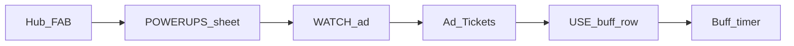

# POWERUPS design — Ad Tickets → buff shop (Variant B)

**Status:** Shipped in code (Ad Tickets → buff shop).  
**Research base:** Brick Inc–style ad currency → shop (see session research /
plan *Ad-valuta research*).  
**Related:** [SHOP_MONETIZATION.md](SHOP_MONETIZATION.md) (real-money ladder).

## Goal

Replace today’s **direct** loop (watch ad → fixed ×2 gold +25% ATK for 3h) with:

1. Watch a rewarded ad → earn **Ad Tickets** (soft currency).
2. Spend tickets in a small **POWERUPS shop** on the buff you want, when you want it.

Same principles as SHOP: opt-in only, never interrupt combat, F2P and payers get
the **same** buffs (payers skip watching / buy tickets).

## Why this shape

| Need | Choice |
|------|--------|
| Player agency | Tickets bank; shop has a few clear rows |
| Avoid Brick Inc currency clutter | **One** new currency + ≤4 shop rows |
| Fairness first | Buffs stay near today’s power — **not** +100% ATK |
| Hub calm / AL20 chase | Entry is a small hub FAB; TODAY stays primary |
| IAP honesty | SHOP sells tickets or time on the **same** buffs |

## Player-facing names (English UI)

| Term | Meaning |
|------|---------|
| **Ad Ticket** | Soft currency from watching one ad (or from SHOP) |
| **SCROLLS** | Sheet / shop title |
| **WATCH** | Earn +1 Ad Ticket |
| **USE** / row buttons | Spend tickets on a buff |

No second jargon name (“ad coins”, “video points”). One word: **Ticket**.

## Loop

## Hub entry (UX)

- **Floating camera overlay** on the hub World Path (portrait, bottom-trailing
  of the map, clear of the hunt card / ENTER and the header Settings cog).
- FAB shows:
  - Rolled-scroll glyph (`UiGlyph.scroll`) at 48dp.
  - Ticket count badge when tickets > 0.
  - Short status under the icon: `WATCH`, `N TICKETS`, or `ATK 42m`.
  - Dim when idle; torch-lit when tickets or a buff is active.
- **No dungeon FAB** in v1 (combat chrome stays clean; ads never mid-fight).
- Tap FAB → bottom sheet with two blocks:
  1. **Earn** — WATCH AD · +1 Ticket (playtest: PREVIEW +1).
  2. **Spend** — catalog rows (below).

Visibility gates:

- Always show on hub, including a new save (WATCH must be findable).
- `adFree`: hide WATCH; keep Spend + daily ticket claim. Hide FAB when
  nothing to claim and no tickets/buff.

## Economy numbers (v1)

| Knob | Value |
|------|-------|
| Tickets per finished ad | **1** |
| Soft earn cap | **None** per day in v1 (revisit if AL20 feels mandatory) |
| Ticket persist | Survives Ascend / REBORN (with other meta) |
| Max stack per buff | **24h** remaining (same as `AdBoost.maxStackMs`) |

Migration from current saves:

- Convert remaining `adBoostUntilMs` into the new **bundled** buff timers
  (gold ×2 + ATK +25% both set to the same `untilMs`), tickets start at **0**.
- Old field can stay as legacy or be cleared after migrate once.

## Buff catalog

Effects stay **same for tickets and SHOP**. Do **not** ship +100% ATK or a paid-only combat class.

| Id | Label | Effect | Duration | Cost | Notes |
|----|-------|--------|----------|------|-------|
| `atk` | Scroll of Damage | **+40% ATK** | **2 hours** | **1** ticket | Combat push |
| `gold` | Scroll of Gold | **×2 gold** (kills, chests, hub AFK) | **2 hours** | **1** ticket | Same ×2 magnitude |
| `xp` | Scroll of XP | **+50% party XP** | **2 hours** | **1** ticket | Combat XP (live + AFK catch-up) |
| `move` | Scroll of Speed | **+30% walk speed** | **2 hours** | **1** ticket | Dungeon travel |
| `loot` | Scroll of Loot | **+40% item find** | **2 hours** | **1** ticket | Additive with pet / STAR loot |
| `speed` | Scroll of Haste | **+25% dungeon speed** | **2 hours** | **1** ticket | Live SpatialCombat dt; KEY/GR timers scale so ladders stay fair |
| `bundle` | Scroll of Battle | **+40% ATK** and **×2 gold** | **4 hours** | **2** tickets | Best ATK+gold ticket value |
| `offline` | Scroll of Rest | Next Welcome Back gold **×3** (one shot) | Until claimed or **24h** | **1** ticket | Idle punch |

### Stack / interact rules

- **Same buff again:** extend remaining time from current end (or from now if
  expired), cap 24h. Effects do **not** stack in magnitude (still +40%, not +80%).
- **`atk` + `gold` both active:** both apply (same as today’s bundle split).
- **`bundle` while split buffs active:** extends **both** timers by 4h (capped).
- **`offline`:** one pending flag; watching another Away Bonus while pending
  refreshes expiry only — does not double-stack the multiplier.
- Bundle and split are the **same** ATK%/gold mult — no extra power from owning
  both labels.

### Why not +100% / 30 min

Brick Inc–style +100% ATK still skews wipe advice and KEY. Shipped bump
**2026-09-15:** +40% ATK / 2h splits / 4h Full Boost / Away ×3 so tickets
feel worth spending. Gold stays **×2**. SHOP sells the same numbers.

## Persist fields (future `metaDepth`)

| Field | Meaning |
|-------|---------|
| `adTickets` | int ≥ 0 |
| `adAtkUntilMs` | Sharp Edge end |
| `adGoldUntilMs` | Gold Rush end |
| `adXpUntilMs` | Study Rush end |
| `adMoveUntilMs` | Fleet Foot end |
| `adLootUntilMs` | Lucky Bag end |
| `adSpeedUntilMs` | Time Warp end |
| `adOfflineMulPending` | bool — Away Bonus ready |
| `adOfflineMulExpiresMs` | expiry if unclaimed |
| `adFree` | unchanged — hide WATCH |
| *(legacy)* `adBoostUntilMs` | migrate → both untilMs, then ignore |

Combat / gold readers use the new until fields (ATK% if `adAtkUntilMs` active;
gold ×2 if `adGoldUntilMs` active). Away Bonus applies only on the next
eligible offline claim path.

## SHOP bridge (real money)

Keep cheap ladder; retarget grants to **tickets** and/or **same buffs**:

| SKU (keep ids) | New grant |
|----------------|-----------|
| `starter_boost_6h` | +**2** tickets **or** +6h Full Boost (prefer **+6h bundle** once for clarity) |
| `boost_12h` | +12h Full Boost (both timers) |
| `day_boost_24h` | +24h Full Boost |
| `ad_free` | Permanent hide WATCH + **+2 tickets** once (welcome) + Brick Inc rule: optional **CLAIM TICKET** without video once every **UTC day** while ad-free (same +1 as WATCH) |
| `supporter_qol` | +4 bag slots + 12h Full Boost (unchanged spirit) |

**Locked rule:** no SHOP SKU grants a stronger combat mult than ticket shop rows.

Update [SHOP_MONETIZATION.md](SHOP_MONETIZATION.md) when coding starts so tables
match this doc.

## Copy (sheet, English)

- Earn blurb: *Watch a short ad for 1 Ad Ticket. Spend tickets on timed boosts.
  Optional — fights never pause for an ad.*
- Cap blurb: *This boost is stacked to 24h — wait for time to burn, then buy
  again.*
- Empty tickets: *WATCH an ad to earn a ticket.*

## Out of scope (v1)

- Dungeon floating icon
- Daily ad impression hard cap
- Extra currencies / gacha / random buff chests
- Progressive “watch more → stronger forever” (Legend of Slime style)
- Changing God Hand / essence / KEY with ads

## Implementation map (when coding is approved)

1. `save-migrate`: new meta fields + migrate `adBoostUntilMs`.
2. Replace / extend `AdBoost` helpers for per-buff timers + ticket math.
3. `GameLogic` spend/earn APIs; wire `GameDirector` WATCH → +ticket; USE → spend.
4. Rebuild [lib/ui/hub/hub_powerups.dart](../lib/ui/hub/hub_powerups.dart) FAB + sheet.
5. Combat/gold/offline readers; What’s New one-liner; tests for migrate / spend /
   cap / Ascend keep / `adFree` daily claim.
6. Sync SHOP catalog strings + billing grants.

## Acceptance (owner AL20 phone)

1. Hub shows a camera overlay on the World Path; hunt card / ENTER still read first.
2. WATCH → +1 ticket; USE Sharp Edge → +40% ATK for ~2h visible in combat feel.
3. USE Full Boost → both gold ×2 and +40% for ~4h (best ticket deal).
4. No ad during an open dungeon fight.
5. Ascend keeps tickets and remaining buff time.
6. SHOP copy still says same power as tickets / ads.
