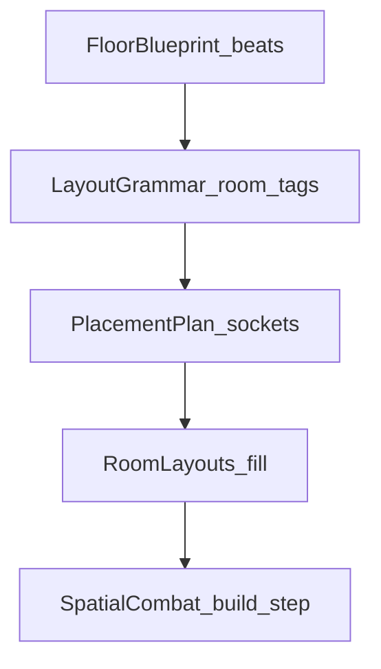

# Floor Blueprint — dungeon generation rebuild

Idle Party — bästa varianten för hur floors **genereras**, **ser ut**, och **var föremål/fiender** placeras.

Status: **SHIPPED (P0–P4)** — Blueprint + PlacementPlan + zone kits wired through
`RoomLayouts` / `SpatialCombat.build` room-chest pickups. Sections below are the
**pipeline contract** (kept for the next zone), not an open backlog.

Showcase: **Rimeglass** (treasure alcoves) vs **Stormwake** (choke). All catalog
zones have a `ZoneLayoutKit`.

Relaterat: [SYSTEMS_REBUILD.md](SYSTEMS_REBUILD.md) (klar), [GEAR_BUDGET.md](GEAR_BUDGET.md) (klar), [zone-art-identity](../.cursor/skills/zone-art-identity/SKILL.md).

---

## Win-condition

Spelaren ska kunna säga: *“det här rummet hade ett jobb”* — approach, choke, skattficka, boss-arena — utan att AFK eller phone-UI bryts.

| Spelarkänsla | Mått |
|--------------|------|
| Zoner känns olika | samma floor-typ i Rime ≠ Storm visuellt *och* i beat-ordning |
| Loot känns placerat | minst en synlig room-reward-socket på treasure/elite beats |
| AFK oförändrat tryggt | samma `SpatialCombat.step`; vacuum/timeout till exit fungerar |
| Ingen save-wipe | blueprint är runtime/layout; `GameState` behöver högst seed-fält som redan finns |

---

## Historical problem (pre-ship)

`DungeonGenerator` only picked encounter stats; `RoomLayouts` scattered props by
density; loot was almost only kill-drops. Zones read as wash/sprites more than
room grammar. That is why Blueprint → PlacementPlan → `ZoneLayoutKit` exists.

---

## Bästa varianten: Blueprint → Layout → Placement

Tre lager. Inget parallellt combat-system.



### Lager 1 — `FloorBlueprint` (vad ska hända)

Deterministisk från `floorNumber + dungeonId + layoutSeed` (samma RNG-anda som idag).

```dart
enum FloorBeatKind {
  approach,   // öppnande pack
  choke,      // trång killbox
  elite,      // elite pocket
  treasure,   // loot-fokuserad alcove / low combat
  boss,       // arena
  exitHold,   // sista clear → path till stairs
}

class FloorBeat {
  final FloorBeatKind kind;
  final int enemyBudget; // maps to today's enemyCount slice
  // ...
}

class FloorBlueprint {
  final RoomType legacyType; // normal/elite/boss/treasure — keep for save/UI
  final List<FloorBeat> beats;
}
```

**Exempel**

| Floor | Beats |
|-------|--------|
| Normal F3 | approach → choke → exitHold |
| Elite F6 | approach → elite → choke → exitHold |
| Treasure F6n | approach → treasure → exitHold |
| Boss | approach → boss → exitHold |

`DungeonRoom` behålls som tunn persistens/UI; blueprint byggs vid `generateFloor` / `SpatialCombat.build` och behöver **inte** serialiseras om seed redan finns.

### Lager 2 — Layout-grammatik (hur det ska se ut)

Varje beat mappar till **rumstaggar** som `RoomLayouts` förstår:

| Tag | Form | Zon får välja bland |
|-----|------|---------------------|
| `approach` | bredare chamber, party spawn | cave mouth / hall / rift ledge |
| `choke` | smal + gate | corridor / ice crack / root tunnel |
| `elite` | medium pocket | side room off main path |
| `treasure` | alcove vid vägg | dead-end med chest socket |
| `boss` | stor arena | befintlig boss-layout + zon-props |
| `exitHold` | exit cell synlig efter clear | stairs/boss stairs |

**Zon-kit** (data, inte if-träd överallt):

```text
ZoneLayoutKit {
  dungeonId
  preferredBeatWeights      // storm: fler choke; rime: fler treasure alcoves
  propRoles → MapPropKind[] // landmark / edgeClutter / hazardFx
  wash / floor / wall        // redan delvis i KenneyAssets + DungeonEnvironment
}
```

Rimeglass blir **showcase-zon**: tysta alcoves + frost landmarks, inte storm-choke-klon.

### Lager 3 — `PlacementPlan` (var saker får ligga)

Innan fiender/loot/props “scatteras”, fyll en plan:

| Socket | Får innehålla | Får INTE |
|--------|---------------|----------|
| `partySpawn` | party | loot, props som blockerar |
| `exit` | stairs | combat spawn ovanpå |
| `gate` | chamber lock | chest mitt i |
| `enemy[chamber][i]` | 1 enemy | overlapping sockets |
| `lootBody` | kill-drop landningszon (mjuk) | blockera exit-path |
| `lootChest` | 0–1 room chest | mid-choke |
| `lootCache` | sällan elite/rare | AFK soft-lock |
| `propLandmark` | 1–3 läsbara props | spam |
| `propEdge` | edge clutter (dagens bias) | spawn/exit/enemy cells |

**Loot-policy (bästa varianten)**

1. **Combat drops** — som nu (`GroundLoot` vid kill + vacuum).  
2. **Room reward** — om blueprint har `treasure`/`elite`-beat: spawna **en** chest/socket-reward när chamber clearas (eller vid build som dormant pickup).  
3. **Setpiece** — zon-unik sällan (shard-hint / lore), max 0–1 per run-segment.

Gear-power stil: [GEAR_BUDGET.md](GEAR_BUDGET.md) oförändrad. Blueprint styr **var/när**, inte BiS-fusk.

---

## API-skiss (filer)

| Ny / ändrad | Roll |
|-------------|------|
| `lib/spatial/floor_blueprint.dart` | `FloorBlueprint.forRoom(...)` |
| `lib/spatial/placement_plan.dart` | sockets från chambers + beats |
| `lib/spatial/zone_layout_kit.dart` | per-`dungeonId` weights + prop roles |
| `lib/spatial/tile_map.dart` | `RoomLayouts` fyller från plan istället för ren densitet |
| `lib/core/dungeon_generator.dart` | anropar blueprint; behåller `DungeonRoom` shape |
| `lib/spatial/spatial_combat.dart` | room-reward spawn hooks; **ingen** ny step-loop |
| `test/floor_blueprint_test.dart` | determinism, socket rules, no path block |
| `test/placement_plan_test.dart` | chest never on exit; enemy sockets unique |

**Icke-mål:** ny roguelike BSP-motor, server maps, andra combat-sim.

---

## Fasplan (implementation log — complete at 1.11.x)

### P0 — Kontrakt + tester (ingen spelarkänsla än)

- Skriv `FloorBlueprint` + gyllene fixtures (seed → beats).
- Skriv `PlacementPlan` validator: path spawn→exit, inga socket-krockar.
- Docs: denna fil = source of truth.

**Verify:** unit tests only; `flutter analyze`.

### P1 — Layout fyller sockets (props + enemies)

- `RoomLayouts` använder enemy sockets + prop landmark/edge.
- Behålla dormant chambers / gate soft-unlock ([spatial-combat-change](../.cursor/skills/spatial-combat-change/SKILL.md)).
- Fallback: om plan failar → dagens scatter (safe degrade).

**Verify:** `dungeon_environment_test`, spatial layout tests, short web glance 360×780.

### P2 — Room rewards

- Treasure/elite beat → `lootChest` pickup.
- Offline parity: samma build/step (chest timeout/vacuum-regler dokumenterade).
- Guide one-liner + What’s New när player-visible.

**Verify:** targeted combat/loot tests + hub/dungeon smoke.

### P3 — Showcase-zon: Rimeglass

- `ZoneLayoutKit` för `rime` (och ev. `storm` som kontrast).
- Beat weights + landmark props + wash redan tonad cyan.
- World Path copy oförändrad; zon ska *kännas* mer “quiet rift”.

**Verify:** zone-art-identity checklist, `ship_smoke`, phone playtest A56.

### P4 — Rulla ut kit till övriga zoner

- En zon i taget (Tide / Ember / Grove …), inte big-bang.
- Gamla zoner får kit med defaults ≈ dagens beteende först.

**Verify:** per-zon identity + analyze; balance gate orörd om inte enemy counts ändrats.

---

## Avvägningar (låsta i planen)

| Val | Beslut | Varför |
|-----|--------|--------|
| Full procgen vs grammar | **Grammar + blueprint** | Phone/AFK; läsbarhet > överraskningskaos |
| Serialisera blueprint | **Nej** (seed räcker) | Enklare migrering |
| Chest mid-fight | **Nej i choke** | Soft-lock / AFK-path |
| Ändra boss floor-formel | **Nej i P0–P2** | Separat balance-diskussion |
| SpatialCombat rewrite | **Nej** | Hård constraint |

---

## Definition of done (hela spåret)

- [x] Blueprint deterministisk för fasta seeds  
- [x] PlacementPlan: inga blockerade exit-paths i tester  
- [x] Props har landmark vs edge (inte bara densitet)  
- [x] Minst treasure/elite room-reward synlig i P2  
- [x] Rimeglass showcase tydligt olik Stormwake (P3)  
- [x] Live + offline samma layout/loot-regler  
- [x] What’s New + guides ärliga när player-visible  
- [x] `flutter analyze lib test`; relevanta layout/loot/ship tests gröna  

---

## Medvetet utanför

- Soft wipe / ny save-generation  
- Nya specs / IAP / Play ops  
- Handmålade unika tilemaps per floor (för dyrt); grammar + zon-kit räcker  
- God Hand redesign  

---

## Körordning (done)

P0 kontrakt → P1 sockets → P2 room rewards → P3 Rimeglass kit → P4 remaining
zone kits. Next zone: follow this contract + `new-dungeon` / `zone-art-identity`;
do not invent a second generator.
