# Idle Party — 1-årsroadmap (2026–2027)

Research-förankrad plan sparad **2026-08-06** (före Q1-implementation).  
Baseline (historical): app **v1.9.3**, full-game audit ~**92%**
([audits/2026-08-03-full-game.md](audits/2026-08-03-full-game.md)) — audit predates
Tide/Ember/meta polish; treat as historical closeout, not current completeness.

**Current ship line:** **1.10.2** (`pubspec` ↔ `MetaSystems.currentVersion`) — Ascend
Blessing, hub TODAY READY/ALMOST, daily keystone vault, 9 zones.

**Status:** dokumenterad; Q1–Q2-kärna + Q4 polish/cadence i kod; Q3 delvis; Play closed
Alpha igång (produktion väntar 12×14). GitHub Releases är primär install.

---

## Research baseline

| Yta | Status | Gap |
|-----|--------|-----|
| Combat / AFK | Stark (`SpatialCombat` enda auktoritet; live+offline parity) | Mid-band caster risk; live-light gate |
| Gear / Apex / BiS | Stark | 2pc/4pc procs shippade; ingen gear-shop (by design) |
| Meta / hub | Payoffs live (Weekly n/3, Will, Gauntlet F25/50/100, season bonus, GH styles) | Prestige shop refresh / deeper sinks stretch |
| Content | **31 specs / 9 zoner** (`tide`, `ember` shippade) | Klass-tungt historiskt; nya zoner mer sällan |
| Distribution | GitHub Releases primary; Play Console listing + closed Alpha | Production needs 12×14; not live |
| Onboarding | `FirstSessionTips` + Guides + What’s New | — |
| A11y / save | Text scale 85–130%, colorblind floaters, VFX modes + reduce-motion label; toast dedupe; clipboard export/import + backup-hint | Lätt owned SFX stretch |

**Inventarie:** 9 zoner ([lib/models/dungeon_def.dart](../lib/models/dungeon_def.dart)), 10 klasser / 31 specs, ~259 abilities, 4 legacy tickers + 27 runner-kits, Infinity Gauntlet AL10+, balance harness ([tool/sim_harness.dart](../tool/sim_harness.dart) live/afk/bare).

**WIP kits (Aug 2026 audits):** Affliction, Beast Mastery, Blood, Demonology, Fury, Unholy, Restoration Druid, Subtlety — se [docs/audits/](audits/). Identity/coeff-pass shippad för alla åtta.

```mermaid
flowchart LR
  subgraph q1 [Q1 Trust]
    Onboard[Onboarding_WhatsNew]
    BalanceCI[Live_AFK_balance_CI]
    PlayInternal[Play_internal]
  end
  subgraph q2 [Q2 Identity]
    Kits[WIP_kit_pass]
    Zone8[New_zone]
    Relics[Relic_expansion]
  end
  subgraph q3 [Q3 Endgame]
    Gauntlet[Gauntlet_milestones]
    Sets[Set_fantasy]
    Weekly[Weekly_seasons]
  end
  subgraph q4 [Q4 Scale]
    Zone9[Second_new_zone]
    PlayProd[Play_production]
    Pipeline[Monthly_content_cadence]
  end
  q1 --> q2 --> q3 --> q4
```

---

## Principer (låsta för året)

- **Offline-first premium** — inga konton, ads eller MMO; eventuell leaderboard senare är opt-in score only.
- **SpatialCombat förblir enda combat-path** — se [AGENTS.md](../AGENTS.md) och `.cursor/skills/spatial-combat-change`.
- **Kenney CC0 + `assets/custom/` only** — inga commercial dumps (`.cursor/skills/assets-legal`).
- **Små releases** (`1.x.y`) varje 2–4 veckor; en hero-feature per kvartal.
- **Mät innan nerf** — `MODE=live` + mid-band i balance-gate (`tool/sim_class_balance.dart`).

**Icke-mål 2026–27:** rewrite av combat; full gear merchant; iOS/Steam launch; live-service servers.

**Kapacitet:** solo / liten tid — kvartalsplanen är prioriterad; stretch markeras under Q4.

---

## Q1 (mån 1–3) — Trust & discovery

**Hero:** Varje ny/återvändande spelare förstår loopen och litar på siffrorna.

1. **What’s New / version sync**
   - Fixa `MetaSystems.currentVersion` (1.4.0 → tracka `pubspec`) i `lib/core/meta_systems.dart`.
   - Auto-visa `WhatsNewOverlay` när `seenChangelogVersion` ≠ current; hub-badge.
   - Per-release bullets (inte en flat evighetslista).

2. **Onboarding v1**
   - Utöka `lib/ui/first_session_tips.dart`: Farm/Push, God Hand, contracts chain, Ascend, Hardmode, Weekly, Gauntlet AL10, Apex.
   - Valfri 1-skärms first-run overlay efter starter-pick (`lib/ui/start_menu_screen.dart`).

3. **Balance CI**
   - Kör `class_balance_sim_test` med `--mode=live` (light) i rutin; mid-band manuell/gate före kit-patches.
   - Stäng residual HIGH (Destruction m.fl.) under live light; dokumentera mid-caster risk.
   - Graduate **minst 4 av 8 WIP-specs** (prioritet: Affliction DoT, BM pet, Unholy ghoul, Fury) via `.cursor/skills/add-ability` / class-audit.

4. **Economy/UX trust**
   - Synliggör kill-gold vs wipe; AL loot-hint; clear-toast redan förbättrad i 1.9.2 — följ upp med essence breakdown om saknas.

5. **Distribution**
   - Release hygiene: tag ↔ `pubspec` ↔ GitHub Release.
   - Release-signing (`key.properties`); AAB (`flutter build appbundle`).
   - `LICENSE` + privacy stub; Play **internal testing**.
   - Web-demo branding (`web/manifest.json` / `index.html`).

**Exit Q1:** Play internal live; What’s New funkar; live-sim gate grön; 4 WIP-kits shippade; tip-täckning mid-meta.

---

## Q2 (mån 4–6) — Identitet & mid-game

**Hero:** Spelet känns som Idle Party — nya platser + klass-fantasy.

1. **Ny zon #8** via `.cursor/skills/new-dungeon`
   - Ny `DungeonDef`, layouts, enemy pool, boss, portrait/backdrop (`assets/custom/`), set-namn, unlock via lifetime gold.
   - Bryt “Crystal är taket” på World Path. → **Sunken Tidehold** (`tide`).

2. **Kit fantasy pass (resterande WIP + 2 showcase)**
   - Klara kvarvarande WIP (Demo, Blood, Subtlety, RDruid).
   - 2 showcase-kits med synlig VFX/identity (inte bara `kitOutMul`).

3. **Relic expansion**
   - +2–3 relics på befintlig Forge/tier/respec-path (`lib/core/game_logic.dart` + Forge UI).

4. **Weekly med tänder**
   - Progress/rewards bortom 3 clears +18e; hub-urgent surface (`lib/ui/hub_screen.dart`).
   - Knyt gärna till Gauntlet-clear för AL10+.

5. **Will / Ascend streak payoff v1**
   - Tröskelbelöningar från redan trackad `collectionScore` / `ascendStreak` i `lib/models/meta_depth.dart`.

**Exit Q2:** Zon 8 live; alla 8 WIP → tune/ship; Weekly synlig; relic-katalog ≥5; streak/Will ger konkret payoff.

---

## Q3 (mån 7–9) — Endgame destination

**Hero:** AL10+ har en anledning att återvända varje vecka.

1. **Gauntlet milestones** — essence/mats/titles vid F25/50/100; behåll AFK soft-cap (anti-mint).
2. **Lokala säsonger (offline)** — rotera weekly pool + Gauntlet cosmetics via ISO-week key (ingen server).
3. **Set fantasy** — 2pc/4pc procs/role-effekter i `lib/models/gear_set.dart`; Apex R3 / gauntlet-slag chase.
4. **God Hand expression** — 1–2 meta-val utan att bära AFK.
5. **Prestige shop refresh** — nya sinks bakom AL-gates.

**Exit Q3:** Gauntlet milestone-ladder; minst en säsongscykel; set-procs syns i combat; prestige har nya sinks.

---

## Q4 (mån 10–12) — Skala & ship

**Hero:** Innehållspipeline + publik release.

1. **Zon #9** + boss kit. → **Ashen Vault** (`ember`).
2. **Play production** (default om signing/privacy klara; annars dokumenterat sideload-only — beslut i Q3-review).
3. **Månadsrytm** — 1 balance-pass (live+mid sim) + 1 content-slice + release notes. → [CONTENT_CADENCE.md](CONTENT_CADENCE.md).
4. **A11y / polish** — reduce-motion bortom `vfxQuality`; toast dedupe; lätt owned SFX.
5. **Save UX** — export/import finns; synliggör + backup-hint.
6. **Stretch:** Windows CI-zip; lokal high-score share image.

**Exit Q4:** 9 zoner; Play (eller dokumenterat sideload-only); dokumenterad cadence; a11y minimum.

---

## Framgångsmått

| Mått | Mål år 1 |
|------|----------|
| Zoner | 7 → 9 |
| WIP kits (audit) | 8 → 0 |
| Balance | Live light ±20% share; mid dokumenterad/tunad |
| Retention rails | What’s New auto; Weekly hub-visible; Gauntlet milestones |
| Distribution | Play internal (Q1) → production (Q4 default) |
| Release cadence | ≥10 tagged releases |

---

## Nyckelfiler

| Område | Path |
|--------|------|
| Combat | `lib/spatial/spatial_combat.dart`, `lib/spatial/ability_effects.dart` |
| Meta UI | `lib/ui/hub_screen.dart`, `lib/ui/meta_overlays.dart`, `lib/ui/first_session_tips.dart` |
| Rules | `lib/core/game_logic.dart`, `lib/models/meta_depth.dart` |
| Content | `lib/models/dungeon_def.dart`, `lib/models/hero_spec.dart` |
| Sims | `tool/sim_class_balance.dart`, `tool/sim_harness.dart` |
| Cadence | [CONTENT_CADENCE.md](CONTENT_CADENCE.md) |
| Baseline audit | [audits/2026-08-03-full-game.md](audits/2026-08-03-full-game.md) |
| Class audits | [audits/](audits/) (2026-08-02-*.md) |
| Skills | `.cursor/skills/` — domain + Cursor workflows (see AGENTS.md “Agent tooling”) |

---

## Implementation checklist

- [x] Q1 What’s New + onboarding tips (`MetaSystems` 1.9.x releases; Farm/Push, God Hand, Ascend, Weekly, Gauntlet, Apex tips)
- [x] Q1 live balance CI + 4 WIP kits (`class_balance_*` tests in CI suite; Affliction / BM / Unholy / Fury graduated)
- [x] Q1 Play internal prep (signing example, AAB workflow, `LICENSE`, [PRIVACY.md](PRIVACY.md), [PLAY_STORE.md](PLAY_STORE.md), web branding) — Console upload still operator-owned
- [x] Q2 zon #8 (`tide` Sunken Tidehold) + relics (≥5) + Weekly tips/hub surface
- [x] Q2 remaining WIP (Demo / Blood / Subtlety / RDruid identity+coeffs) + Will/streak claims
- [x] Q3 Gauntlet milestones + set 2pc/4pc fantasy (season monthly bonus on first weekly claim; 4pc combat procs)
- [x] Q4 zon #9 (`ember` Ashen Vault) + cadence doc + a11y/save polish (toast dedupe, Minimal VFX = reduce motion, backup hint)
- [x] Q4 Play production listing (or explicit sideload-only decision) — **sideload / GitHub Releases is primary**; Play optional per [PLAY_STORE.md](PLAY_STORE.md)
