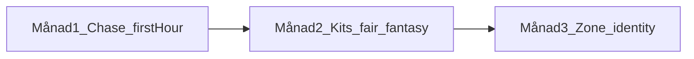

# Idle Party — 90-dagars strategi (topplistor + våra lärdomar)

**Sparad:** 2026-08-13 · Ship-linje vid skrivning: **1.11.5**  
**Bas:** [TOP_GAMES_RESEARCH.md](TOP_GAMES_RESEARCH.md) + det vi redan byggt/lärt i spelet  
**Rythm:** [CONTENT_CADENCE.md](CONTENT_CADENCE.md) · Chase: [CHASE_CONTRACT.md](CHASE_CONTRACT.md)

Win-condition om 90 dagar: en ny spelare (telefon A56) förstår *vad de jagar*, känner *power*, och varje tag känns som ett tydligt “avsnitt” — inte mer kaos.

---

## 0. Principer vi håller hårt i (lärda i kod + topplistor)

### Från topplistorna (kort)

| Lärdom | Vi gör så här |
|--------|----------------|
| Tydlig jakt | En chase-källa (`ChaseContract`) — aldrig ny prioritetslista i UI |
| Feel + fairness | Balance gate / share-fast innan “kul men stompar” får leva |
| System > handmålning | Floor blueprint / zone kits / regler — inte unika maps per floor |
| Iteration i öppenhet | GitHub Releases + What’s New; skärp efter skepp |
| Billig proto | Tunnt bevis innan stor art/lore |
| Inte Rockstar-crunch | Polish via DoD + tester, inte övertidsromantik |

### Från Idle Party (det vi redan betalat för att lära)

1. **Ärlighhet i power** — affinity/armor-crumbs i BiS ljög; budget-score (`GEAR_BUDGET`) vann. Ljug inte i UI/UPGRADE igen.  
2. **En chase-ordning** — ALMOST (zon/Will/Gauntlet/Ascend-nära) måste slå “gör daily” — annars känns hubben panikig.  
3. **Samma sanning överallt** — hub TODAY ↔ offline “Up next” ↔ Ascend-teaser. När de divergerade blev spelet opålitligt.  
4. **SpatialCombat är auktoritet** — live och AFK samma step; genvägar i sim/tester som ljuger om clear/loot skapar CI-helvete och fel känsla.  
5. **Nya system kräver testkontrakt** — room chests bröt AFK-vacuum/kill-loot/difficulty-gates. Varje ny spawn/loot-väg = uppdatera tester *i samma batch*.  
6. **Fairness-first på HIGH** — Unholy ~62 % share: sänk tills gate är grön; behåll identity (namn/VFX), inte siffrorna.  
7. **Zoner med ansikte** — Rimeglass vs Stormwake (kits + wash) funkar; “reskin crystal” gör det inte.  
8. **Stora ärliga batchar** — hellre en tag med zon + blueprint + chase-fix än tio halvmesyrer. Föreslå commit/push/tag när det är ship-shaped.  
9. **Phone-first** — bedöm UI på **360×780**, inte desktop-web.  
10. **Play ops i bakgrunden** — content/feel först; 12×14 stänger inte feature-tåget.

---

## 1. Nuläge (vad som redan är “toppliste-klart”)

| Spår | Status |
|------|--------|
| Hub TODAY / ChaseContract | Shipped |
| Offline story + Up next | Shipped |
| Gear budget honesty | Shipped |
| Floor blueprint + room chests + 12 zoner (→ Rime) | Shipped (1.11.5) |
| Ascend Blessing | Shipped |
| Kit unlock fantasy (Meet … / pending reveals) | Shipped (P3) — Month 2 continues fairness + fantasy polish |
| Keystone-lager / God Hand-riktning | Shipped soft defaults (P4/P5) — **not** 90-day main track unless chase/kits/zones are satisfied |

---

## 2. 90 dagar — tre månader, tre fokus

Varje månad ≈ 1–2 taggar (`1.11.x` / `1.12.x`). Innehåll enligt cadence: **balance + content slice + What’s New**.

### Månad 1 — Chase & första timmen (Habit-polish)

**Mål:** Spelaren vet alltid nästa steg; första timmen känns *power*, inte raid.

| Vecka | Gör | Klart när |
|------|-----|-----------|
| 1 | Audit chase på telefon: TODAY, klaim, Ascend ALMOST, Meet kit | A56-pass: 0 “vad ska jag göra?”-ögonblick i 10 min hub |
| 2 | Första-session tips: KEY-jargon mjuk; early calm (redan delvis) | Tips stör inte; `ship_smoke` / hub-smoke grön |
| 3 | Offline welcome: headline + ≤3 highlights + Up next = samma chase | Manuell offline-dialog = hub-titel |
| 4 | Tag: chase/copy-polish + What’s New | Analyze + changelog sync + föreslå release |

**Toppliste-parallell:** Mass Effect / BG3 / Hades — “vad jagar jag?” + session som funkar kort *eller* lång.  
**Vår lärdom:** ChaseContract är kontraktet — utöka ytor, hitta inte på ny logik i widgets.

**Inte i M1:** Ny zon, ny spec, God Hand-omdesign, Play Console-sprint.

---

### Månad 2 — Kits: fairness + fantasy (inte fler klasser)

**Mål:** Befintliga DPS/heal/tank *känns* som sin fantasy och håller ±20 % share-band.

| Vecka | Gör | Klart när |
|------|-----|-----------|
| 1 | Share-fast board: lista HIGH/LOW outliers | JSON + markdown i `tool/out/` |
| 2–3 | Nerf/buff tills live-light gate grön; behåll namn/VFX/rotation | `class_balance_gate_test` grön |
| 2–3 | Fantasy-pass på 1–2 kits (VFX/HUD/ability copy) som redan är OK i siffra | Class-audit light + spelaren “känner spec” |
| 4 | Meet / unlock teasers: AscendRoadmap + pendingHeroReveals ärliga | PARTY “Meet …” matchar unlock; ship_smoke |

**Toppliste-parallell:** Valve skär det som inte håller; Celeste/From = ärlig challenge; BG3 = klasser som *betyder* något.  
**Vår lärdom:** HIGH = trimma nu. Kits före nya specs (owner prefs).

**Inte i M2:** 3+ nya HeroSpecId. Mid-band deep sims bara om något känns “spicy” efter light gate.

---

### Månad 3 — Zon #13 (eller stark identity-pass) + blueprint-cadence

**Mål:** En ny zon *eller* två äldre zoner som får tydligare kit-ansikte — samma pipeline som Rimeglass.

| Vecka | Gör | Klart när |
|------|-----|-----------|
| 1 | Proto: unlock-jakt + 1-mening fantasy + ZoneLayoutKit-skiss (ingen final art) | “Känns olik granne-zonen?” ja/nej |
| 2 | Katalog + layouts via blueprint/kit; enemies/portraits via Kenney/custom | `zone-art-identity` checklist |
| 3 | Lore, achievement, Apex crumb, World Path-markör, ship_smoke | Kartan ljuger inte |
| 4 | Tag + What’s New; balans orörd om enemy counts oförändrade | Analyze/tests; APK via tag om ni vill |

**Toppliste-parallell:** BotW/TotK — system + identity; inte 10 000 unika rum.  
**Vår lärdom:** Rime vs Storm funkade; room chests kräver test-uppdatering i samma PR.

**Fallback om zon känns för stor:** identity-pass på Tide/Ember/Grove (kits + wash + 1 landmark) istället för helt ny `#13`.

---

## 3. Veckorytm (håll den tråkig)

Varje arbetsvecka, i ordning:

1. **Ett spelar-mål** (en mening: “TODAY ska aldrig visa Daily när Ascend är ALMOST”).  
2. **Implementera minsta batch** som bevisar det.  
3. **Verify:** `flutter analyze lib test` + relevanta tester (share / ship_smoke / changelog).  
4. **Kort A56-koll** om UI rördes.  
5. **Föreslå** commit / push / PR / tag — pusha inte tyst.

Månadsskifte: en mening i What’s New som spelaren bryr sig om (English).

---

## 4. Explicit non-goals (90 dagar)

- IAP / ads / konton  
- iOS eller web-som-produkt  
- SpatialCombat-rewrite  
- God Hand filosofi-omdesign (fråga owner först — P5)  
- Play production som huvudmål (12×14 får ticka i bakgrunden)  
- Många nya specs “för listans skull”  
- Kopiera AAA-crunch eller “väx team ×3”

---

## 5. Framgångsmått (enkla)

| Mått | Bra tecken |
|------|------------|
| Chase | Hub + offline samma titel/urgency i stickprov |
| Fairness | Inga DPS `HIGH` på live-light gate |
| Feel | A56: första 15 min = progress, inte förvirring |
| Cadence | ≥1 player-visible tag / månad med ärlig What’s New |
| System | Nya loot/layout-vägar har tester i samma commit |
| Scope | Hellre 1 zon med ansikte än 3 utan |

---

## 6. Snabb beslutstabell

| Om ni tvekar mellan … | Välj |
|------------------------|------|
| Ny spec vs polisha kit | Polisha kit |
| Ny zon vs mer hub-chrome | Ny zon *om* chase redan är tydlig; annars chase |
| Cool affinity-nudge vs budget | Budget |
| Skippa test “för att CI flakar” | Fixa kontraktet / mjuk gate med anledning — gutta inte |
| Stor rewrite vs small ship | Small ship + avsnitt |

---

## 7. Koppling till befintliga docs

| Doc | Roll |
|-----|------|
| [TOP_GAMES_RESEARCH.md](TOP_GAMES_RESEARCH.md) | Varför-strategierna |
| [CHASE_CONTRACT.md](CHASE_CONTRACT.md) | Månad 1 lag |
| [GEAR_BUDGET.md](GEAR_BUDGET.md) | Power-ärlighet |
| [FLOOR_BLUEPRINT.md](FLOOR_BLUEPRINT.md) | Månad 3 pipeline |
| [SYSTEMS_REBUILD.md](SYSTEMS_REBUILD.md) | P3 kits → efter M1; P4/P5 efter 90d |
| [CONTENT_CADENCE.md](CONTENT_CADENCE.md) | Tag-rytm |
| [ROADMAP.md](ROADMAP.md) | Årshorisont — detta doc är *nästa kvartal* |

---

## Uppdateringslogg

| Datum | Ändring |
|-------|---------|
| 2026-08-13 | Första 90-dagarsplan: topplistor + Idle Party-lärdomar |
