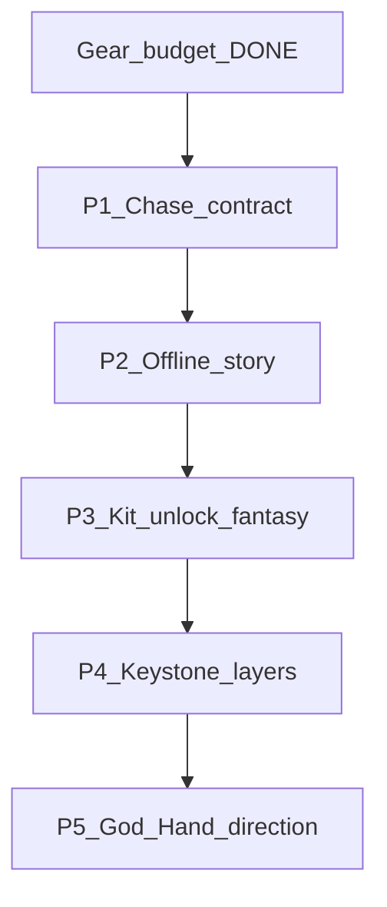

# Systems rebuild roadmap

Idle Party — ombyggnadsplan för system **utöver** gear-budget.

**Gear-budget** ([GEAR_BUDGET.md](GEAR_BUDGET.md) + `itemBudgetScore`) räknas **klar** och ingår inte här.

**Principer**

- Phone-only (~360×780), English in-game copy, fairness-first
- Migrera / wrappa befintlig state — scrapa inte saves
- SpatialCombat / chambers / World Path-katalog lämnas som arkitektur
- Varje fas: What’s New + guide-honesty + `ship_smoke` / changelog där det behövs

---

## P1 — Chase-contract (“vad jagar jag?”) — DONE

Shipped: `docs/CHASE_CONTRACT.md`, `ChaseContract.fromState`, hub TODAY + offline
Up next wired to the same facade. Selection still in `HubChase.forState`.

---

## P2 — Offline / AFK som story — DONE

Shipped: `OfflineProgressResult` wow headline + ≤3 ranked highlights; offline
dialog drops the AFK-mechanics essay and keeps ChaseContract Up next.

---

## P3 — Kit unlock / roster fantasy — DONE

Shipped: `HeroIdentity.meetBlurb` / `meetHook` / `meetDetail`; Meet chase +
Ascend `nextMissingKitTeaser` include Watch… hooks for AL ladder kits.

---

## P4 — Keystone / daily vault i lager — DONE

Shipped: `GameLogic.showKeystoneJargon` gates KEY/weekly-affix chrome; early
vault chase stays clear-and-claim; mid+ keeps KEY +2 cliffs.

---

## P5 — God Hand (riktning → feel) — DONE

Default **steer-toy**: tip + guides + Forge KEEP blurb stress tap-to-steer/burst;
BAL/FOCUS/WIDE + CD = soft knobs (not a talent tree).

---

## Medvetet utanför

- Soft wipe av gear/saves
- SpatialCombat rewrite
- Massor av nya specs / IAP
- Play Store ops (bakgrund)
- Prestige-shop deep sinks (stretch)

**Nästa stora system-spår (plan):** floor generation — se [FLOOR_BLUEPRINT.md](FLOOR_BLUEPRINT.md)
(Blueprint → layout-grammatik → PlacementPlan; SpatialCombat kvar).

---

## Körordning

| Fas | Batch | Verify |
|-----|-------|--------|
| P1 Chase | Medel | ship_smoke, hub unit |
| P2 Offline | Medel | offline tests + phone glance |
| P3 Kits | Liten–medel | roadmap/guides |
| P4 Keystone | Medel | chase copy + guide |
| P5 God Hand | Liten | guides + 360×780 playtest |

Efter varje fas: What’s New, analyze, föreslå commit/push/tag.
