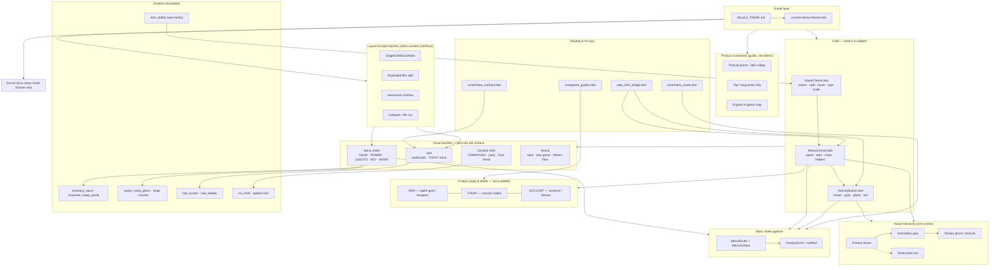

# Idle Party UI theme

**Purpose:** shared **tokens and patterns** so menus feel like one game — not a straitjacket on layout, copy, or UX. When clarity needs a new row, scroll, or hub-specific chrome, **ship it** using tokens below. IA (what the player chases) is separate from visuals.

---

## System map (what UI theme steers)

**How to read it:** `UI_THEME.md` sets rules and patterns; **`GameTheme` → `MenuChrome` → `KenneyButton`** is the implementation stack. **RUN / TODAY / ACCOUNT** is information architecture (section labels, guides, chips) — orthogonal to colors. **Visual family** chooses which token subset applies; hub and dungeon intentionally skip full GEAR sheet chrome.

---

**Code sources of truth:**

| Piece | File |
|-------|------|
| Colors, radii, touch, type scale | [`lib/ui/game_theme.dart`](../lib/ui/game_theme.dart) |
| Panels, tabs, chips, helpers | [`lib/ui/menu_chrome.dart`](../lib/ui/menu_chrome.dart) |
| Actions | [`lib/ui/kenney_button.dart`](../lib/ui/kenney_button.dart) |
| Menu sheet reference layout | [`lib/ui/character_equip_panel.dart`](../lib/ui/character_equip_panel.dart), [`lib/ui/shell/inventory_dock.dart`](../lib/ui/shell/inventory_dock.dart) |

---

## Product constraints (not design limits)

- **Portrait phone only** (~360–430 CSS px). Owner reference: **Samsung A56** → **360×780**. Live look: A56 emulator (`a56-playtest`).
- **Tap / long-press** — no hover-only flows for real players.
- **English** in-game copy.

Everything else (hub density, Gauntlet label, chase-driven CTAs, collapsible sections) is **game UX**, not theme violations.

---

## Visual families (pick the right one)

| Family | Where | Goal |
|--------|--------|------|
| **Menu sheet** | PARTY / POWER / META overlays | GEAR-adjacent panel: `MenuChrome.panel`, `tabRail`, `cardBox` |
| **Hub** | World path, TODAY, enter stack | Painted scene + torch accents; **not** a full inventory sheet |
| **Combat HUD** | Dungeon FARM/PUSH, party bars, God Hand | Pixel HUD (`GameTheme.pixel`) |
| **Brand** | Boot, new game, What’s New hero | Cinzel + scene art; rules are looser |

GEAR is the **default reference for menu sheets**, not a mold for hub or dungeon.

---

## Action hierarchy (use all levels)

Avoid stacking multiple **brown** full-width buttons on one screen (especially hub).

| Level | When | API |
|-------|------|-----|
| **Primary** | One main job on this screen (ENTER, CLAIM, BUY) | `KenneyButtonStyle.brown`, `primary: true` for hero CTAs |
| **Secondary** | Valid alternate (skip for now, cancel, ENTER when claim is READY) | `KenneyButtonStyle.grey` |
| **Tertiary / nav** | Open another menu (“KEY”), inline | `MenuChrome.textLink` or `KenneyButtonStyle.ghost` |
| **Text link** | Low emphasis, inline | `MenuChrome.textLink` |
| **Destructive** | Ascend, merge commit, wipe confirm | `KenneyButtonStyle.red` |

Semantics / `WebClickScope`: `KenneyButton` and `MenuChrome` helpers already wire labels for playtest.

**Exclusive compact choices** (spend ×1 / 5% / …): use **`MenuChrome.segmented`** — one row, equal slots. Do not Wrap tappable `chip`s for this; InkWell expands to max width and stacks full-height on phone.

---

## Information architecture (not colors)

Three buckets — use in copy, section labels, and guides (not a new palette):

| Bucket | Meaning | Examples |
|--------|---------|----------|
| **RUN** | Wallet gold / dungeon spend | FORGE → GOLD, MARKET flasks, dungeon |
| **TODAY** | Session habits & claims | vault, jobs, daily run, hub TODAY |
| **ACCOUNT** | Essence / forever meta | essence, CAMP, KEEP, Apex, codex |

Helpers: `MenuChrome.scopeChip`, `sectionLabelScoped(title, scope: MenuScope.run|today|account)`, or plain `sectionLabel` when scope is obvious.

**Hub stack (phone):** TODAY text → at most **one brown** primary + **one grey** secondary under it; everything else tertiary/link/chip. MetaPulse crumbs hide when TODAY is READY/ALMOST.

**Tab context:** status that belongs to one tab (e.g. “Claim: …”) → **`MenuChrome.tabBanner`** on that tab only, not every META sub-tab.

---

## Tokens (quick)

**Surfaces:** `MenuChrome.panel`, `scrim`, `cardBox`, `listCard`, `hubPanel` (hub banners), `sheetRadius`  
**Radii:** `GameTheme.radiusSm` (8) / `radiusMd` (12) / `radiusLg` (18)  
**Type:** `menuTitle` (Cinzel) · `body` (VT323) · `sectionLabel` / `sectionLabelScoped` · `button` · `pixel` (HUD/tags only)  
**Color:** `parchment` / `parchmentDim` · `torch` / `torchHot` · `mossLit` · `scopeRun/Today/Account` · `rarity*` · `tooltip*` (item tips)  
**Touch:** `minTouch` 44 · `primaryTouch` 48  

Prefer tokens over hex literals. Hub uses `hubPanel`, not full `cardBox` sheet chrome.

---

## Layout escape hatches (when content doesn’t fit)

Phone height is the real limit, not the theme. Use these **before** dropping information:

1. **`SingleChildScrollView`** on dense tabs (CAMP, SETTINGS).
2. **Split `Expanded` flex** (e.g. CODEX milestones scroll horizontally; list gets remaining height).
3. **`tabRail` scrollable** — long tab names (SETTINGS) are fine.
4. **Collapse / link out** — hub KEY detail lives in the KEY tab, not a second full panel on hub.
5. **Horizontal `ListView`** for chip/button rows that used to `Wrap` and overflow.

Overflow stripes = layout bug, not “theme says no.”

---

## Menu sheet checklist (new overlay)

1. Shell: `OverlayScrim` / `MenuChrome.panel` pattern in [`menu_surface.dart`](../lib/ui/shell/menu_surface.dart).
2. Title: `GameTheme.menuTitle` or router title.
3. Multi-page → `MenuChrome.tabRail` + `MenuChrome.bridgedTab`.
4. Lists → `listCard` / `cardBox`.
5. Actions → hierarchy table above.
6. Tab-specific status → `tabBanner` on that tab only.

---

## Intentionally different surfaces

Do **not** force GEAR sheet chrome onto:

- Combat / dungeon HUD  
- Bottom nav  
- Start menu / intro / new-game picker  
- Hub world-path scene (caption + chase stack are hub-native)  
- Item tooltips (long-press on phone; compact compare in bag)

---

## Anti-patterns (actual harm)

- Raw hex borders/colors that bypass `GameTheme` / `MenuChrome`
- Material `TextButton` in forge-style confirm dialogs (use `MenuChrome.dialog` + `KenneyButton`)
- Press Start for menu **titles** or long body paragraphs
- **Three+ brown full-width CTAs** on one hub view
- Global alert banners on every tab when only one tab owns the message
- Hover-only affordances on shipping phone UI

---

## Agents

When adding shared chrome, put helpers on **`MenuChrome`** (or `KenneyButton` styles) and add **one line** here. Extend the theme; don’t fork colors in a single screen.
