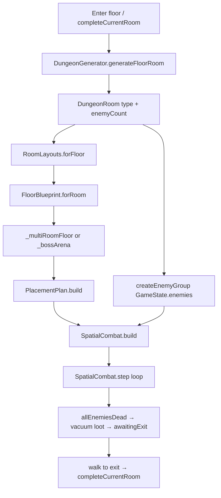

# Dungeon floor generation audit

**Date:** 2026-09-10  
**Auditor:** agent (code + tests; no A56 play session)  
**Depth:** full pipeline (encounter → geometry → placement → combat runtime)  
**Scope:** all 15 zones, normal/elite/treasure/boss floors, Gauntlet `bossEvery`  
**Playtest?** unit tests + code trace only  

**Source of truth:** [`docs/FLOOR_BLUEPRINT.md`](../FLOOR_BLUEPRINT.md) (shipped P0–P4). This audit verifies code matches that contract and notes gaps.

## Summary

Dungeon floors are built in **five deterministic stages** with **one combat sim** (`SpatialCombat`). Nothing serializes a blueprint to save — `layoutSeed` + `floorNumber` + `dungeonId` + `RoomType` re-derive everything at build time.

| Stage | What it decides | File |
|-------|-----------------|------|
| 1. Encounter roll | boss / elite / treasure / normal, enemy level & count | `lib/core/dungeon_generator.dart` |
| 2. Story beats | approach → choke / elite / treasure → exitHold | `lib/spatial/floor_blueprint.dart` |
| 3. Tile geometry | multi-chamber carve, corridors, gates, spawns | `lib/spatial/tile_map.dart` (`RoomLayouts`) |
| 4. Placement | props, landmarks, room-chest sockets | `lib/spatial/placement_plan.dart` + `zone_layout_kit.dart` |
| 5. Combat world | heroes, dormant enemies, ground loot, gates | `lib/spatial/spatial_combat.dart` |

**Verdict:** **ship** — pipeline is wired end-to-end, tested across all zones, offline uses the same `build`/`step`. Residual risks are **carve fallback** (rare legacy scatter), **beat/chamber count mismatch** (budget fallback), and **boss floors** using a separate arena path (by design).

---

## End-to-end flow



**Persistence:** `GameState` keeps `currentRoom`, `dungeonFloor` (1-element list), `layoutSeed`, `dungeonId`. Blueprint/placement are **not** JSON fields.

---

## Stage 1 — Encounter roll (`DungeonGenerator`)

`generateFloor()` returns **one** `DungeonRoom` per floor (one combat wave).

| Rule | Implementation |
|------|----------------|
| Boss floor | `floorNumber == bossFloorFor(ascensionLevel)` default; Gauntlet passes `bossEvery: 5` |
| Treasure | `!boss && floorNumber % 6 == 0` → `RoomType.treasure`, **0 enemies** |
| Elite | random roll (14% early / 38% later) **or** guaranteed every 3rd floor from F6+ |
| Normal | otherwise |
| Enemy level | `(floor-1)*2 + 1` + `0..2` jitter |
| Enemy count | boss 6–7, elite 4+, normal 3+, treasure 0 |

RNG: `Random(floorNumber * 7919 + dungeonId.hashCode + layoutSeed)`.

**Honesty:** UI/save still speak `RoomType` (normal/elite/boss/treasure). Blueprint **layers on top** — it does not replace the type roll.

---

## Stage 2 — Floor blueprint (`FloorBlueprint`)

Built from `DungeonRoom` + `dungeonId` + `layoutSeed` (+ type index in seed).

| `RoomType` | Typical beats | Enemy budget |
|------------|---------------|--------------|
| **boss** | approach → **boss** → exitHold | all on boss beat |
| **treasure** | approach → **treasure** → exitHold | 0 combat |
| **elite** | approach → elite → choke/approach → exitHold | split ~50/50 |
| **normal** | approach → choke **or** approach+choke; optional **treasure alcove** (zone kit) | summed to `enemyCount` |

**Zone kit knobs** (`ZoneLayoutKit` ← `ZoneArt.byId`):

- `preferChoke` — more choke beats (fen, veil, tide, goblin, …)
- `preferTreasureAlcove` + `treasureAlcoveChance` — normal floors can add a quiet side vault (rime, brass, goblin, …)
- `eliteRoomChest`, `normalRoomChestChance` — extra chest policy

`exitHold` is a **story terminator**, not a carved chamber (`storyChambers` excludes it).

**Chest policy:** `wantsRoomChest` true for treasure beats, elite beats on elite floors, or legacy treasure type.

Tests: `floor_blueprint_test.dart` — determinism, budget sum, kit contrasts (rime vs fen, brass vs veil).

---

## Stage 3 — Tile geometry (`RoomLayouts`)

Entry: `RoomLayouts.forFloor(floorNumber, room, dungeonId, layoutSeed)`.

### Canvas size (by `DungeonLayoutKind`)

| Layout | Zones (examples) | cols × rows |
|--------|------------------|-------------|
| hideout | goblin, tide | 48 × 38 |
| fort | king, hell, brass | 54 × 40 |
| arena | underworld, crystal, storm, … | 52 × 36 |
| cave (default) | sandy, dead, rime, … | 54 × 38 |

Boss floors bypass multi-room and use **`_bossArena`** (34×26) with north/south bays.

### Beat-driven carve (`_multiRoomFloor`)

1. Place **main spine** rooms eastward with zigzag (even index north, odd south).
2. **Treasure** beats branch as **side vaults** off the last main chamber (not on exit spine).
3. Connect with corridors; **gates** on corridor cells (`opensAfterChamber`).
4. Spawn on **first** main room; **exit** on **last** main room (not side vault).
5. **Enemies** only in chambers **index ≥ 1** (`firstCombat = 1` in SpatialCombat) — chamber 0 is staging/approach.

**Enemy placement:**

- If `rooms.length == storyBeats.length`, use per-beat `enemyBudget`.
- Else **fallback**: ~55% first combat room, rest split (`budgetByChamber` empty path).
- Treasure chambers with budget 0 stay empty.

**Degrade path:** if `< 2` rooms placed after beat carve → **legacy scatter** (`fallbackRoomCount` 5–8 rects). Still playable; loses beat grammar.

### Gates

`GateInfo.opensAfterChamber` — cleared when that chamber’s enemies die. `SpatialCombat` opens gates + proximity-wakes dormant enemies so soft-locks are rare.

---

## Stage 4 — Placement (`PlacementPlan`)

Runs **after** geometry, before returning `TileMap`.

| Socket | Rules |
|--------|--------|
| **lootChest** | Preferred chamber: treasure → elite → last; edge cell; never spawn/exit/enemy |
| **landmarks** | Per-chamber from `kit.landmarks`; extra in treasure alcoves |
| **clutter** | Density + per-chamber minimum from `ZoneArt` |
| **blocked** | spawn, exit, enemy cells |

**Fallback:** if `plan.props.isEmpty` → `_scatterProps` (pre-blueprint Kenney density).

**Violations** (`chest_on_exit`, etc.) are recorded on `PlacementPlan` but **do not abort** the map — tests assert chests never on spawn/exit/enemy for all zones.

---

## Stage 5 — Combat runtime (`SpatialCombat.build` / `step`)

| Feature | Behavior |
|---------|----------|
| **Room chests** | `map.lootChestPoints` → `GroundLoot` at build via `rollRoomChestLoot` |
| **Kill drops** | unchanged — vacuum on floor clear |
| **Dormant enemies** | `chamberIndex > firstCombat`; wake on proximity (~11 tiles) |
| **Floor clear** | `allEnemiesDead` → instant vacuum → `awaitingExit` → party walks to stairs |
| **Offline / AFK** | same `build`/`step` inside `GameLogic.simulateSpatialOffline` (`afkAssist` damage tuning only) |
| **Hideout** | `HideoutStash` — chest cells can spawn ambush guards (goblin identity) |

Gauntlet: `bossEvery` only affects **encounter** roll; layout still uses boss arena when type is boss.

---

## Determinism & seeds

| Input | Used by |
|-------|---------|
| `floorNumber` | Generator, RoomLayouts seed, blueprint |
| `dungeonId` | Generator, blueprint, kit, art |
| `layoutSeed` | Stored on `GameState`; new seed each floor advance; **preserved** on `restartFloor` for daily echo |
| `room.type.index` | RoomLayouts + blueprint RNG salt |

Same inputs → same beats, map, props, chest cells (verified in tests for blueprint; full map tested per zone for chest safety).

---

## Zone identity (layout layer)

All 15 zones have `ZoneArt` entries → `ZoneLayoutKit`:

- **customDungeonArt** true everywhere (owned clutter rules)
- **Landmarks** per zone (not generic scatter only)
- Grammar contrasts tested: rime/brass treasure vs fen/veil choke; goblin raider den; tide choke+treaure

Visual wash/tiles/enemies are **separate** in `ZoneArt` but consumed by the same manifest — aligns with `zone-art-identity` skill.

---

## Test coverage

| Test file | What it proves |
|-----------|----------------|
| `test/floor_blueprint_test.dart` | Determinism, boss/treasure shapes, kit per zone, chest never on spawn/exit/enemy (all zones), treasure chest on rime, budget sum, choke tighter than approach, large canvas, treasure off stairs, zigzag spread, rime chest in alcove |
| Spatial / ship tests (elsewhere) | Layout hooks in CI via analyze + ship smoke when touched |

**Not covered in unit tests:** every seed never hits legacy scatter fallback; boss arena beat tags; Gauntlet boss-every-5 layout variety; pathfinding proof spawn→exit (implicit via play).

---

## Findings

### P0 — none

Pipeline matches shipped `FLOOR_BLUEPRINT.md`. No second combat sim. No save migration needed.

### P1 — watch items

| Item | Risk | Mitigation today |
|------|------|------------------|
| Beat carve fails → legacy scatter | Floor loses “room job” readability | Rare; 64–80 placement attempts first |
| `rooms.length != storyBeats.length` | Enemy budget even-split, not beat-faithful | Fallback block in `_multiRoomFloor` |
| Placement violations not fatal | Bad chest slot could theoretically ship | Elite floor test loops all zones; treasure uses edge candidates |
| Boss = separate arena | Boss floors don’t use choke/treasure grammar | Documented; intentional |

### P2 — polish / future

| Item | Notes |
|------|--------|
| `exitHold` invisible as geometry | Only a beat flag — OK for idle, no player label |
| Chamber count vs `fallbackRoomCount` | Legacy count still influences scatter fallback only |
| Setpiece loot (lore shard) | Not implemented — OK per FLOOR_BLUEPRINT “out of scope” |
| Explicit path validator test | Mentioned in P0 plan; coverage is indirect |

---

## Composition with game loop

```
completeCurrentRoom
  → roll loot / gold / missions
  → new layoutSeed
  → DungeonGenerator.generateFloor(nextFloor)
  → createEnemyGroup(nextRoom)
  → SpatialCombat.build (reads layoutSeed from state)
```

Farm loop keeps same floor number; push advances. Ascend resets bag but **not** zone unlock path.

---

## Compared to docs

| Doc claim | Code status |
|-----------|-------------|
| Blueprint → Placement → ZoneLayoutKit | **match** |
| Multi-chamber + gates | **match** |
| Room chest on treasure/elite | **match** |
| Rime showcase vs storm choke | **match** (kit tests) |
| All zones have kit | **match** (`DungeonCatalog.all`) |
| Offline parity | **match** (same spatial API) |
| No blueprint serialize | **match** |

---

## Recommended next steps (owner pick)

1. **Playtest** one rime normal floor + one fen choke floor on A56 — “does this room have a job?”
2. **Optional:** metric/log when legacy scatter fallback triggers (dev-only) to measure carve fail rate.
3. **Optional:** add explicit spawn→exit BFS test for random seeds (harder soft-lock guarantee).

**Out of scope:** new zone #16, BSP procgen, God Hand redesign, boss floor formula change.

---

## Follow-up shipped — 1.12.136 (Batch A + hub)

| Item | Status |
|------|--------|
| Hub chamber (`FloorBeatKind.hub`) + side elite/treasure off hub | **wired** — `floor_blueprint.dart`, `tile_map.dart` |
| Decoy dead-end alcove (0 enemies, clutter only) | **wired** — blueprint + placement skip chest |
| Winding / alternate L-corridor carve | **wired** — `corridorWindingChance` per zone |
| Vertical spread boost | **wired** — `verticalSpreadBoost` in kit |
| Zone grammar knobs | **wired** — `zone_art.dart` → `ZoneLayoutKit` |
| Tests | **wired** — `floor_blueprint_test.dart` hub/decoy/chest |
